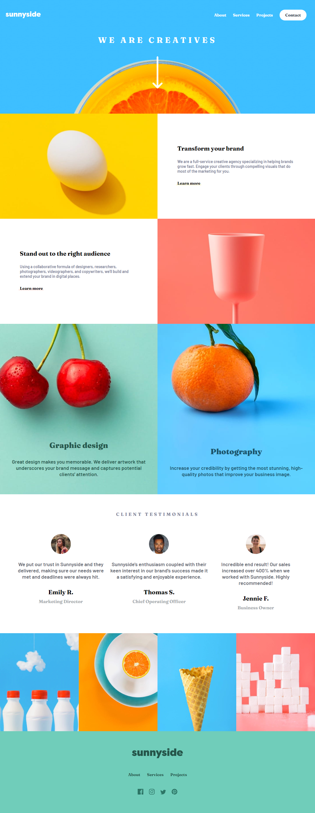
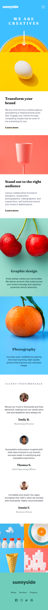

# Sunnyside agency landing page
This is a solution to the Sunnyside agency landing page challenge on Frontend Mentor.

### Screenshot

  
  

### Links
- Solution URL: [(https://github.com/patryk468/Sunnyside-agency)]
- Live Site URL: [(https://patryk468.github.io/Sunnyside-agency)]

### Built with
- Semantic HTML5 markup
- SASS(SCSS)
- Flexbox
- Mobile-first workflow
- JavaScript

## Author
- Patryk O.
